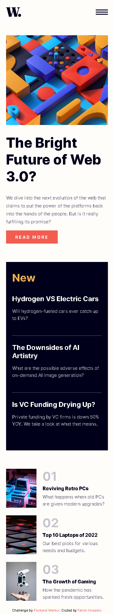

# Frontend Mentor - News homepage solution

This is a solution to the [News homepage challenge on Frontend Mentor](https://www.frontendmentor.io/challenges/news-homepage-H6SWTa1MFl). Frontend Mentor challenges help you improve your coding skills by building realistic projects.

## Table of contents

- [Overview](#overview)
  - [The challenge](#the-challenge)
  - [Screenshot](#screenshot)
  - [Links](#links)
- [My process](#my-process)
  - [Built with](#built-with)
  - [Author](#author)

## Overview

### The challenge

Users should be able to:

- View the optimal layout for the interface depending on their device's screen size
- See hover and focus states for all interactive elements on the page
- **Bonus**: Toggle the mobile menu (requires some JavaScript)

### Desktop Screenshot

### Mobile Screenshot

### Mobile Menu Screenshot

### Links

- Solution URL: [Github](https://github.com/Mr-NotSoCreative/news-homepage-main)
- Live Site URL: [Add live site URL here](https://your-live-site-url.com)

## My process

### Built with

- Semantic HTML5 markup
- CSS custom properties
- CSS Flex
- CSS Grid
- JavaScript

## Author

- Frontend Mentor - [@Mr-NotSoCreative](https://www.frontendmentor.io/profile/Mr-NotSoCreative)
- Github - [@Mr-NotSoCreative](https://github.com/Mr-NotSoCreative)